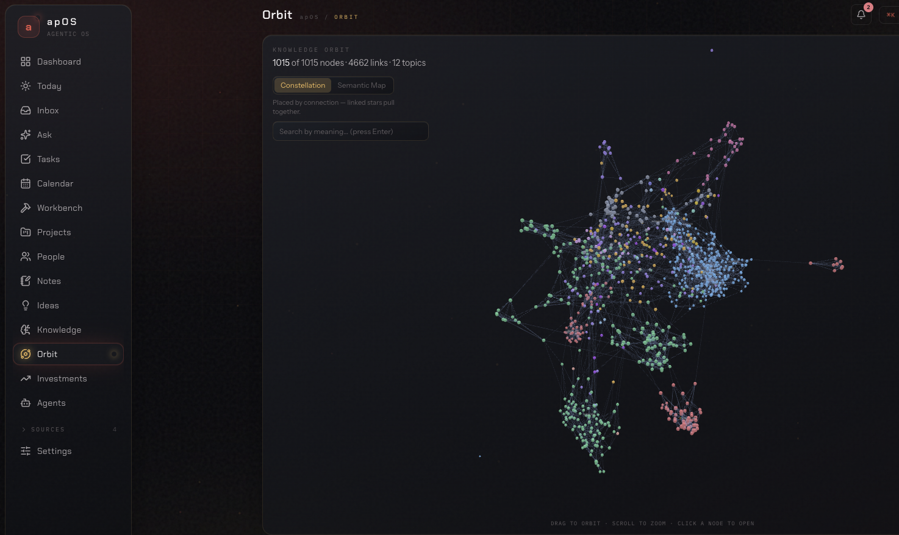

# apOS — Agentic Personalized Operating System

> **One calm home for your projects, notes, and ideas — everything ingested and interconnected, so you can _ask_ across all of it and get cited answers. Runs entirely on your own machine. Private by default, free by default.**

<p align="center">
  
</p>

<p align="center">
  <em>Your day at a glance — what needs you, what's on, what's moving — assembled from every part of your system.</em>
</p>

---

## Why I built it

I'd been living in Notion, Obsidian, and a rotating cast of great apps to manage my
projects, ideas, and to‑do lists. Nothing ever stuck. Not because the tools are bad —
they're excellent — but because they keep growing: more features, more integrations, more
surface. All that richness starts to create confusion, and every few months you're
re‑learning the tool instead of using it.

So I built the thing I actually wanted: **one system where my projects, ideas, and notes —
work and personal — are all ingested and interconnected.** When I ask a question, the
answer is grounded in _everything_ I've connected and everything I've written, not one silo
at a time. (I still love Obsidian for local, private, easily‑interlinked notes — inspired
by [Andrej Karpathy's LLM‑wiki idea](https://gist.github.com/karpathy/442a6bf555914893e9891c11519de94f)
— and apOS reads that vault too.)

**Why local‑first?** Three reasons. So anyone with a decent machine can run it and get the
full benefit without a bill. So I can explore and think through ideas **privately**. And so
the cost stays under my control. (Also: it was genuinely fascinating to build.)

If you've bounced between beautiful tools that never quite stuck — this is meant to be the
one that does: **an operating system for your work that helps you make progress every day.**

> **The guiding principle:** don't overload it with capabilities. Every feature has to earn
> its place. The aim is a system that stays simple to use and keeps you moving at your own
> daily pace — not one you have to re‑learn every few months.

---

## What you get

### 🧠 Ask your own knowledge — with citations
Ask a question in plain language; get an answer synthesized from your notes, knowledge,
Obsidian vault, ideas, tasks, and files — **and nothing from the open web unless you say
so.** Every claim is cited back to the source it came from.

> _Reach for it when:_ "What did I save about X, and which of my projects does it touch?" —
> the answer no single app could give you, because your stuff was scattered across all of them.

<p align="center"></p>

### 🤖 Autonomous agents that work while you don't
Named, scheduled agents that read your system and act — a morning digest, a project‑health
pulse, an inbox triager. They run on **free local models**, keep a live transcript, and
never double‑do work. Install one from a module template, or write your own.

> _Reach for it when:_ you want the routine stuff — "what moved, what's stale, what needs me" —
> handled before you sit down, without paying per token.

<p align="center"></p>

### 💡 An ideas pipeline with an AI reality‑check
Capture a spark; apOS pressure‑tests it — a verdict (pursue / explore / park), a score,
strengths, risks, and concrete validation steps — then lets you promote the good ones
straight into a project.

> _Reach for it when:_ you have ten ideas and need an honest second opinion on which one is
> actually worth your next month.

<p align="center"></p>

### 📥 Capture anything → it becomes searchable
Paste a link, a repo, a video, a quote, a stray thought. apOS fetches, summarizes, tags,
and files it — then embeds it into one **semantic search** across your whole system
(pgvector + a local embedding model). Capture cost approaches zero; the filing is the
machine's job.

> _Reach for it when:_ you find something worth keeping and don't want to decide, right now,
> where it goes.

<p align="center"></p>

### 🕸️ See your whole system as a living graph
**Orbit** renders everything apOS has connected — knowledge, your Obsidian vault, notes,
ideas, tasks, projects, people, memory — as one interconnected graph over the same semantic
index. Switch between a **3D constellation** (a live force layout you can fly through) and a
**2D map** — an **Obsidian‑style physics graph**: draggable, self‑organizing, and clustered
by meaning into colour‑coded **topic territories a local model names for you**. Search by
meaning to light up the nearest items, drill into any topic, or trace the **bridges** that
quietly connect two subjects.

> _Reach for it when:_ you want to _see_ how your thinking hangs together — which topics are
> dense, what's isolated, and where two areas of your life overlap.

<p align="center"></p>

### 🗂️ The everyday surfaces, connected
**Tasks, Projects, Calendar, Inbox, Notes, People** — the ordinary building blocks, but
cross‑linked (a task knows its project; a note knows its idea) and rolled up into one
Dashboard and a "Today / needs‑you" queue. One ⌘K bar drives all of it.

### 🔒 Local & private — no metered bill can start by accident
Everything runs on **your** machine on free local models via [Ollama](https://ollama.com).
Metered API keys are actively **stripped** from the app and every process it spawns, so a
stray key can never quietly start billing you. Claude (via a Max/Pro subscription, no API
key) and other providers are **optional** upgrades you turn on per‑task later.

<p align="center"></p>

### 🎨 Five looks, one keystroke
Re-skin the whole app from **Settings › Appearance** — a real light mode, a retro terminal, and more. Not just recolors: surfaces, glow, background, and even the type change.

| Mission&nbsp;Control | Daybreak | Nebula | Phosphor | Slate |
|:--:|:--:|:--:|:--:|:--:|
|  |  |  |  |  |
| deep-space _(default)_ | true light mode | cosmic violet | amber terminal | flat minimal |

---

## Requirements

- **macOS (Apple Silicon)** — full support, both editions (and MLX if you opt in).
- **Windows & Linux** — the container edition runs here too (on Windows, inside WSL2). See the [per-platform install steps](#install) below.
- **Docker** — [OrbStack](https://orbstack.dev) / Docker Desktop (macOS) or Docker Engine (Linux/WSL2).
- **[Ollama](https://ollama.com)** — local models + embeddings (runs on the host).
- **Node 20+** and **pnpm** — only for the native (dev) edition; the container edition doesn't need them.

## Install

`./install.sh` does everything — but it's genuinely **one command only on macOS**. On **Windows** and **Linux** you install Docker first (a few steps), then run the same command. Jump to your platform:

- [macOS (Apple Silicon)](#macos-apple-silicon)
- [Windows (step by step)](#windows-step-by-step)
- [Linux](#linux)

### macOS (Apple Silicon)

Open **Terminal** (⌘-Space, type `Terminal`, Enter), then paste:

```bash
git clone https://github.com/tamirgz/AIOS.git && cd AIOS
./install.sh
```

`install.sh` installs anything missing (Homebrew, Colima for Docker, Ollama), picks a model set from your RAM, pulls the models, and starts the app in Docker with Ollama on the host. It opens **http://localhost:3777** when it's done. Re-runnable and safe.

**Options** (work on every platform):

```bash
./install.sh --dry-run       # print the plan, change nothing
./install.sh --tier lite     # smaller model set (lite | standard | full)
./install.sh --brain cloud   # low-spec: local embeddings + free OpenRouter reasoning
./install.sh --native        # macOS only: host-native (launchd) + full Workbench CLI agents
```

### Windows (step by step)

apOS runs in Linux containers, so on Windows you run it inside **WSL2** — a real Linux environment built into Windows. Do these in order:

1. **Install WSL2 + Ubuntu.** Open **PowerShell as Administrator** — click **Start**, type `PowerShell`, right-click **Windows PowerShell**, choose **Run as administrator** — then run:
   ```powershell
   wsl --install -d Ubuntu
   ```
   **Reboot** when it asks. After the reboot an **Ubuntu** window opens and asks you to create a username and password — type them (this is your Linux login; the password stays invisible as you type, which is normal).
2. **(Optional) GPU.** If your PC has an NVIDIA GPU, install the latest **[NVIDIA Windows driver](https://www.nvidia.com/download/index.aspx)** — CUDA then works inside WSL2 automatically. No NVIDIA GPU? Skip this; apOS still runs (use `--brain cloud` in step 5 if the machine is low-spec).
3. **Open the Ubuntu shell.** Click **Start → Ubuntu** (or open Windows Terminal and pick the **Ubuntu** tab). Everything below is typed **in this Ubuntu window**, not in PowerShell.
4. **Install Docker Engine.** Paste this whole line and press Enter (type your Ubuntu password if asked — invisible again):
   ```bash
   curl -fsSL https://get.docker.com | sh && sudo usermod -aG docker $USER
   ```
   Then **close the Ubuntu window and open it again** so the Docker permission takes effect. Check it worked:
   ```bash
   docker ps      # should print a header row with no error
   ```
   > **Important — use Docker Engine _inside_ WSL2 (this step), not Docker Desktop.** With Docker Desktop, containers reach the **Windows** host (`host.docker.internal` → Windows), so they can't see the Ollama that `install.sh` runs inside Ubuntu, and the install reports Ollama unreachable. Confirm you're on Engine-in-WSL2:
   > ```bash
   > docker info --format '{{.Name}} / {{.OperatingSystem}}'
   > # your distro, e.g. ".../ Ubuntu 22.04" — NOT "Docker Desktop"
   > ```
   > If it says **Docker Desktop**, either run the Engine step above so everything lives in Ubuntu together, or keep Docker Desktop and run Ollama on Windows (see the note under this list).
5. **Install apOS** (still in Ubuntu):
   ```bash
   git clone https://github.com/tamirgz/AIOS.git && cd AIOS && ./install.sh
   ```
   This installs Ollama, pulls the models, and starts the app — all inside WSL2. Low-spec PC? use `./install.sh --brain cloud` (see [cloud-brain](#low-spec-machine-use-the-free-cloud-brain)).
6. **Open the app.** In your normal Windows browser, go to **http://localhost:3777** (WSL2 forwards it for you).

> **Rather use Docker Desktop + Ollama-for-Windows?** It works at runtime, but `install.sh` can't drive a *Windows-native* Ollama from WSL2. You'd install [Ollama for Windows](https://ollama.com/download) (set `OLLAMA_HOST=0.0.0.0`), `ollama pull` your models **on Windows**, then from your WSL2 checkout start just the stack: `docker compose -f deploy/docker-compose.yml up -d --build`. The all-in-WSL2 path above is simpler.

### Linux

1. **Install Docker Engine** (Debian/Ubuntu shown; reopen your shell afterwards so the group applies):
   ```bash
   curl -fsSL https://get.docker.com | sh && sudo usermod -aG docker $USER
   ```
2. **Install apOS:**
   ```bash
   git clone https://github.com/tamirgz/AIOS.git && cd AIOS && ./install.sh
   ```
   It installs Ollama, pulls the models, and starts the stack.
3. **Open http://localhost:3777.**

### Editions & Ollama networking

- **Two editions:** **container** (default — `deploy/docker-compose.yml`, Ollama on the host; see [`deploy/README.md`](deploy/README.md)) and **native** (macOS only — launchd services + full Workbench CLI agents; see [`docs/RUNTIME.md`](docs/RUNTIME.md)).
- **Ollama networking:** the containers reach Ollama at `host.docker.internal:11434`, so it must listen on all interfaces (`OLLAMA_HOST=0.0.0.0`). The installer starts it that way for you — and if Ollama was already running on localhost only, the reachability check prints the exact one-line fix for your OS. You don't configure it by hand.

### Low-spec machine? Use the free "cloud-brain"

No powerful GPU or much RAM? apOS still works. Embeddings run on a **tiny local model** (`nomic-embed-text`, ~300 MB — runs on almost anything), and the **reasoning** (chat, agents, Ask) uses **[OpenRouter](https://openrouter.ai)'s free tier** instead of a local chat model.

`install.sh` auto-selects this under ~8 GB RAM, or force it with `--brain cloud`:

1. **`./install.sh --brain cloud`** — pulls only the embedding model.
2. Get a **free** key at **[openrouter.ai/keys](https://openrouter.ai/keys)** — paste it when prompted, or add it later in **Settings → Connections → OpenRouter**.
3. Done — reasoning is routed to a free model automatically. Change it anytime in **Settings → AI Routing** (any model id ending `:free` is $0).

Your data still lives only on your machine — only the reasoning prompt is sent to OpenRouter; search, embeddings, and storage stay local.

<details><summary>Manual setup (dev / without the installer)</summary>

```bash
cp .env.example .env.local
docker compose up -d                  # Postgres 17 + pgvector on :5544 (creates the extension)
pnpm install
ollama pull nomic-embed-text qwen3:8b qwen3-coder:30b
pnpm db:migrate
pnpm dev        # web → http://localhost:3777
pnpm worker     # agent runner — separate terminal, REQUIRED
```

Background service (survives reboots): `scripts/render-launchd.sh web worker orbstack`
renders the launchd agents from `launchd/*.plist.tmpl` to your paths and installs them.
Logs: `~/Library/Logs/aios-*.log`; after a code change: `launchctl kickstart -k
gui/$(id -u)/com.aios.web` (and `.worker`).
</details>

**Operational rule:** after `pnpm db:generate && pnpm db:migrate`, restart `pnpm dev` and
`pnpm worker` — pooled Postgres connections and the worker don't pick up DDL/code live.

## Optional upgrades

- **Claude** (deeper reasoning): install the `claude` CLI, run `claude setup-token`, and
  put the token in `.env.local` as `CLAUDE_CODE_OAUTH_TOKEN`. Then re-route any task to
  the `anthropic` provider in **Settings → AI Routing**. Runs on a Claude Max/Pro
  subscription — no per-token API key.
- **Apple MLX** (faster local inference via LM Studio, Apple Silicon): opt-in — see
  [`docs/MODEL-ROUTING.md`](docs/MODEL-ROUTING.md).
- **OpenRouter** (cloud models, incl. a **free tier**): add a key from
  [openrouter.ai/keys](https://openrouter.ai/keys) in **Settings → Connections**, then route
  any task to it in **AI Routing**. This is also the [low-spec "cloud-brain"](#low-spec-machine-use-the-free-cloud-brain)
  path — free reasoning without a capable GPU.
- **Integrations** (Calendar, Gmail, Slack, Obsidian, Notion, web search): connect each in
  **Settings → Connections**. All optional; apOS is fully useful with none.

## What runs on your machine — and what it never touches

- **Ollama runs on the host** and does the AI locally (full GPU). In the default **container
  edition** the app + Postgres run in Docker; the **native edition** runs the app on the
  host with only Postgres in Docker. Either way, the model inference is on your machine.
- **No metered billing can start by accident:** metered API keys
  (`ANTHROPIC_API_KEY`, `OPENAI_API_KEY`, …) are stripped from the process and every child
  at startup — local models and subscription auth only.
- It does **not** modify your shell profile, system settings, or global git config; all
  scratch state lives under `~/.aios/`.

See [`docs/RUNTIME.md`](docs/RUNTIME.md) for the full topology and
[`docs/MODEL-ROUTING.md`](docs/MODEL-ROUTING.md) for which model serves which task.

## Architecture in 60 seconds

- `src/core/` — shell (animated bg, sidebar, ⌘K bar), DB client, AI layer, module contract.
- `src/modules/<name>/` — one folder per module: `manifest.ts` (client metadata: nav, icon, ⌘K commands) + `manifest.server.ts` (pages, widgets, Drizzle schema, AI tools, agent templates, background jobs).
- `src/modules/registry.ts` + `registry.server.ts` — **one import line per module, per file**. That's the whole integration surface.
- `src/worker/` — host-run agent runner: cron scheduling (croner), one-live-run-per-agent DB guard, heartbeats + orphan sweep, `agent_ledger` processed-items manifest for idempotent scheduled runs, module job channels (knowledge enrichment runs here).
- AI: `AIProvider` abstraction with Ollama + Apple-MLX (OpenAI-compatible) and Anthropic (Agent SDK, subscription) adapters; per-job routing table (`ai_routes`) editable in Settings; every module's `aiTools` are auto-exposed to chat **and** agents (agents get a per-agent allowlist).
- **Memory blocks**: labeled, size-budgeted `memory_blocks` injected into every AI call; chat/agents maintain them via `memory.update`; editable in Settings.
- **Inbox**: universal capture → AI triage routes into tasks/notes/knowledge/calendar; `task:`/`note:` prefixes in ⌘K hit CRUD directly, zero tokens.
- **Semantic search**: pgvector + local `nomic-embed-text`; worker embeds new rows every 2 min; `search.everything` tool + "related — by meaning" panels.
- **Approvals**: tools can declare `risk: "approval"` — unattended agent runs park the call in a pending-approval queue instead of executing.

## Adding a module

1. `mkdir src/modules/foo` → write `manifest.ts`, `manifest.server.ts`, `schema.ts`, pages/widgets/tools.
2. Add one line to `registry.ts` and one to `registry.server.ts`.
3. `pnpm db:generate && pnpm db:migrate`, restart dev + worker.

Nav entry, routes (`/m/foo`), dashboard widgets, ⌘K commands, AI tools, agent templates, and background jobs all appear with zero core edits.

## What's inside today

- **Capture** — a universal Inbox with AI triage (plus a zero‑token ⌘K fast‑path: `task:` / `note:`) · paste‑anything Knowledge (links, repos, video, quotes → auto‑fetched, summarized, tagged) · read‑only Obsidian‑vault ingest · markdown Notes.
- **Think & decide** — **Ask** (cited answers across your whole corpus) · an **Ideas** pipeline with an AI reality‑check → promote to project · **Projects** with health, goals, next‑action + a per‑project advisor · **Tasks** (board, priorities, due dates, project/feature links).
- **Automate** — autonomous **Agents** (cron‑scheduled, live transcripts, idempotent ledger, install‑from‑template) · a **Workbench** to delegate longer jobs to CLI executors · an approvals queue for risky actions · notifications to the bell + Slack.
- **Connect & control** — per‑task **AI routing** (local Ollama · Apple MLX · optional Claude subscription · optional Gemini · OpenRouter with a free tier) · memory blocks injected into every call · **Calendar** (Google/ICS sync) + a Today "needs‑you" queue · People · integrations for Google, Slack (two‑way), Notion, Obsidian, keyless web search & a reader proxy · 5 themes.
- **Foundation** — one **semantic search** across everything · an **Orbit** knowledge graph (a live 2D Obsidian‑style physics map + a 3D constellation, clustered by meaning into named topics) · local‑first & private (no metered key can start billing) · a plugin architecture (a module = a folder + two registry lines) · container & native editions with a one‑command installer.

## Roadmap — thinking out loud

These are directions I'm considering, and I'm honestly trying to work out which would add the most real value and day‑to‑day productivity, without breaking the "keep it simple" principle above. **I'd love your feedback:** which of these would you actually use? What's missing?

- 🎙️ **Voice capture** — speak a thought; it's transcribed locally and triaged into the right module.
- 📱 **Quick‑capture companion** — a menubar drop‑zone and a phone PWA, synced back to your system.
- 🗣️ **Spoken daily brief** — your morning digest as local text‑to‑speech, ready before coffee.
- 🔁 **Offline‑first sync** — CRDT‑based, so your system travels across devices and merges later.
- ✉️ **Email co‑pilot** — draft replies grounded in your own context; triage the inbox for you.
- 🧩 **Module marketplace** — install community modules and agents in a click.
- 🔐 **Encrypted vault** — at‑rest encryption for the truly private stuff.
- 🖥️ **First-class Windows/Linux packaging** — one-command native installers beyond today's WSL2/Docker path.
- 🎨 **Theme editor** — design your own look, not just the five.

**Have a take?** Open an issue — or a 👍 on one that resonates — and that's how I'll decide what's actually worth building next. Want to build a module yourself? PRs welcome.

## License

[MIT](LICENSE).

---

<sub>Screenshots are from a demo instance seeded with fictional data — no personal information.</sub>
